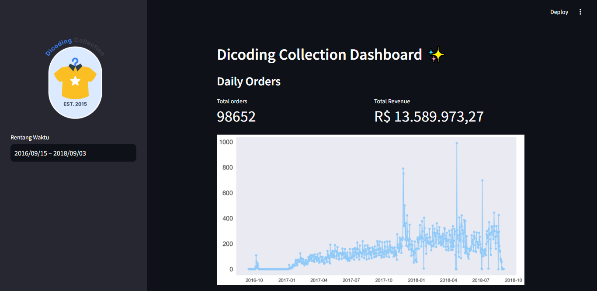
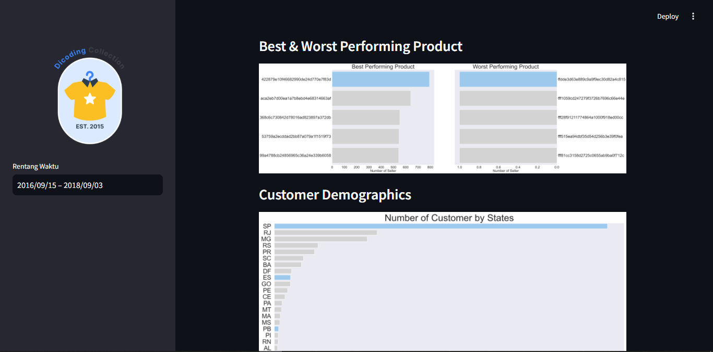

# ✨ E-Commerce Data Analysis & Dashboard

[](https://pxlap3hvzncc6ywyt3qvxf.streamlit.app/)

🔗 **[Live Demo](https://pxlap3hvzncc6ywyt3qvxf.streamlit.app/)**

Proyek analisis data end-to-end menggunakan **Brazilian E-Commerce Public Dataset (Olist)**, mulai dari data wrangling, exploratory data analysis (EDA), hingga dashboard interaktif berbasis Streamlit. Dibuat sebagai submission final untuk kelas *"Belajar Analisis Data dengan Python"* di Dicoding.

## 📊 Business Questions

Analisis pada proyek ini menjawab beberapa pertanyaan bisnis berikut:
1. Produk apa yang paling banyak dan paling sedikit terjual?
2. Bagaimana performa penjualan dan revenue perusahaan dalam beberapa bulan terakhir?
3. Bagaimana demografi pelanggan berdasarkan kota dan negara bagian?
4. Kapan terakhir pelanggan melakukan transaksi, dan seberapa sering mereka bertransaksi? (analisis RFM)
5. Berapa banyak uang yang dihabiskan pelanggan dalam beberapa bulan terakhir?

## 📸 Preview

| Overview & Daily Orders | Best/Worst Product & Demographics |
|---|---|
|  |  |

## 🗂️ Project Structure
```
├── dashboard/
│   ├── dashboard.py          # Streamlit dashboard app
│   └── all_data.csv          # Cleaned & merged dataset (hasil wrangling)
├── images/                   # Screenshot preview dashboard
├── data/                     # Dataset mentah (raw) dari Olist
│   ├── customers_dataset.csv
│   ├── orders_dataset.csv
│   ├── order_items_dataset.csv
│   ├── products_dataset.csv
│   └── sellers_dataset.csv
├── Proyek_Analisis_Data.ipynb  # Notebook analisis (wrangling, EDA, visualisasi)
├── requirements.txt
└── README.md
```

## 🛠️ Tech Stack
- Python (pandas, numpy)
- Matplotlib & Seaborn (visualisasi)
- Streamlit (dashboard interaktif)
- Babel (formatting currency)

## ⚙️ Setup Environment - Anaconda
```
conda create --name main-ds python=3.9
conda activate main-ds
pip install -r requirements.txt
```

## ⚙️ Setup Environment - Shell/Terminal
```
mkdir proyek_analisis_data
cd proyek_analisis_data
pipenv install
pipenv shell
pip install -r requirements.txt
```

## 🚀 Run Streamlit App
```
streamlit run dashboard.py
```

## 👤 Author
**Anastia Firyal Nisrina**
Dicoding ID: anastia_06

## 📌 Data Source
[Brazilian E-Commerce Public Dataset by Olist](https://www.kaggle.com/datasets/olistbr/brazilian-ecommerce) — via Kaggle.
